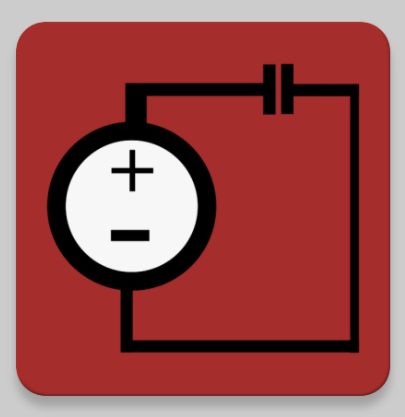

# Circuit Solver Android App

  <b>Documentation:</b> 
  <a href="docs/THERequirements.pdf">Requirements</a> |
  <a href="docs/DesignDocument.pdf">Design</a> |
  <a href="docs/TestPlan.pdf">Test Plan</a> |
  <a href="docs/CPEN 321 Final Presentation.pdf">Final Presentation</a>
    
  

Please follow the links above to our documentation for more information. Look at the [Final Presentation](https://github.com/Frikster/CircuitSolverApp/blob/master/docs/CPEN%20321%20Final%20Presentation.pdf) for a summary of everything.

## Functionality Showcase

1. OpenCV (Canny Edge detection, Hough Lines transform and DBScan clutering) was used for image processing
2. TensorFlow was used to recognize components found by OpenCV
3. Android NDK and NgSpice open source circuit simulator were used for solving the resultant circuit, given particular inputs

## Automated Testing using Espresso and JUnit

